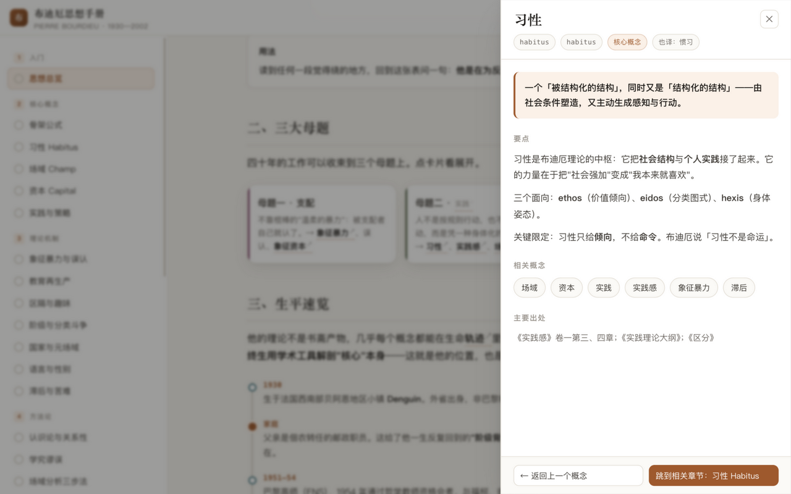
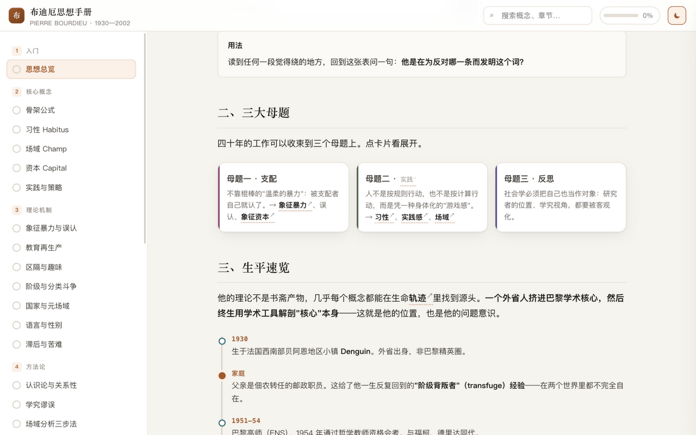
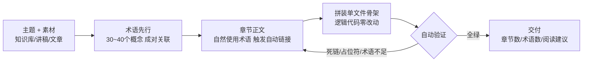
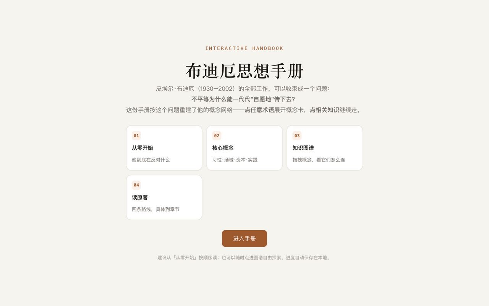

# 点读手册 progressive-handbook

> **难知识，点着学。**

一个 AI Agent Skill：把任何主题或本地知识库，做成一本**可以点着读的单文件 HTML 交互手册**——读者顺序读章节，遇到不懂的词**点开即有解释**，读完可自测，全程离线。

[它解决什么](#它解决什么问题) · [核心体验](#核心体验) · [快速开始](#快速开始) · [工作原理](#它是怎么生成的) · [真实成品](#两个真实成品) · [边界](#边界与承诺)



*↑ 真实成品截图：布迪厄思想手册。点击正文中的术语，右侧滑出概念卡——定义、要点、相关概念、原文出处，关闭后无缝续读。*

## 它解决什么问题

任何有门槛的知识（一个学科、一套方法论、一份内部课程）分发出去时，都卡在同一个地方：

```
读者遇到不懂的词 → 要么硬着头皮跳过（半懂不懂），要么丢下文章去搜索（回不来了）
```

公众号排版解决美观，不解决门槛；AI 直接生成的长文解决产量，不解决「读到一半卡在一个词上」。

点读手册把解释层从阅读流里拆出来，做成**按需展开的抽屉**：

```
遇到不懂的词 → 点它 → 抽屉里看定义和相关概念 → 关掉 → 接着读
```

这个形态不是新发明：游戏圈叫它「P社手册」（Paradox 的 nested tooltips），学界叫**渐进披露**（progressive disclosure）。教育技术研究中「纯非线性超文本让读者迷航」的老问题（lost in hyperspace），靠它的**双结构**解决——线性章节主线防迷航，术语抽屉和概念图谱管深度。

## 核心体验

### 1. 点词即释，不打断阅读

解释永远是右侧叠加层：没有弹窗、没有强制跳转。概念卡里的相关概念本身也可点，可以一层层跳下去（抽屉里再开抽屉），`Esc` 或 `←` 随时原路返回。


### 2. 概念图谱：看一眼知识长什么样

全部概念按语义分成六组着色，用力导向图连成网络，可拖拽、可调关系密度。读者迷航时回图谱看一眼全貌，再决定往哪走。



### 3. 从零基础到自测，一条完整动线

| 模块 | 作用 |
| --- | --- |
| 分层章节（1~6 层，每章标注预计时长） | 零基础按层递进 |
| 术语速查表 | 中英对照，复习用 |
| 常见误区 | 提前拆掉读者会踩的坑 |
| 自测 | 读完验证，不是白读 |
| 阅读进度 | 每章一个「标记已读」，存在浏览器本地，随时中断随时回来 |

### 4. 单文件、零依赖、双击即开

一个 HTML 装下全部：章节、概念数据、图谱、测验。没有外部请求、不需要服务器、发微信发邮件都行，十年后打开还能用。

## 快速开始

**安装**（任选其一）：

```bash
npx skills add Tim-builder/progressive-handbook
```

或把本仓库克隆进你的 Agent skills 目录（`.zcode/skills/`、`.claude/skills/` 等均可）。

**使用**——对你的 Agent 说一句话：

> 帮我把「布迪厄」知识库做成一本点读手册

> 把这套新员工培训资料做成渐进披露式的交互学习页

Agent 会完成内容设计、拼装、自动验证，产出：

```
<工作区>/<主题名>知识手册/<主题名>知识手册.html
```

## 它是怎么生成的



与传统「写完再说」相反，本 skill **先设计术语网络，再写章节**——章节正文里自然地用到这些词，自动链接才会生效，图谱的边才有据可依。

## 两个真实成品

| 成品 | 主题 | 说明 |
| --- | --- | --- |
|  | 技能教程 | 39 个术语的完整实例，本仓库 README 教学场景的直接产物 |
|  | 学术理论 | 本形态的起点，当对照答案用 |

同一副骨架，两种气质：教程版冷静直给，学术版衬线纸质——配色、字体、图例语义全部按主题重写。

## 仓库结构

```
SKILL.md                      # 主流程：模式谱系、设计不变量、工作流
references/content-design.md  # 内容设计规范：大纲层级、术语字段
references/verification.md    # 交付前验证清单与浏览器冒烟片段
scripts/verify_handbook.py    # 结构自动检查：死链/占位符/术语下限
assets/handbook-skeleton.html # 单文件手册骨架（逻辑零改动的模板）
assets/screenshots/           # 本 README 所用真实截图
```

## 边界与承诺

- **不做公众号排版**，不做没有术语层的普通静态长文——那不需要这个 skill。
- 内容忠于用户素材，不编造事实；转述外部知识时在概念卡注明出处位置。
- 素材含未授权私密内容时拒绝写入；不覆盖已存在的交付目录。
- 验证不过且无法定位原因时停止并报告，**不带病交付**。

## License

MIT
